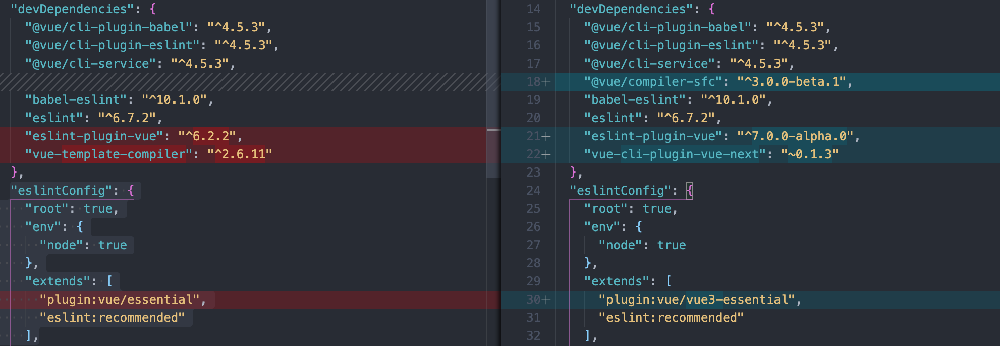
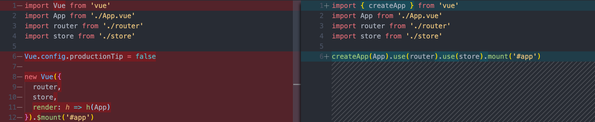
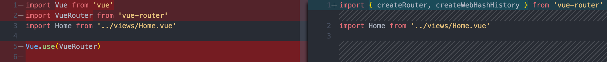
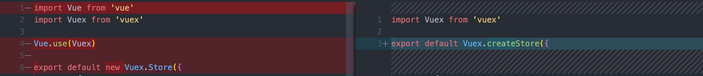

# vue3-demo
Examples for vue-next features

## 一、创建项目

```
vue create vue3-demo
```

## 二、更新vue-cli(4.5.0开始支持初始化vue3的项目)

### 查看vue-cli可用发布版本

```
npm info @vue/cli
```

```
@vue/cli@4.5.3 | MIT | deps: 34 | versions: 127
Command line interface for rapid Vue.js development
https://cli.vuejs.org/

keywords: vue, cli

bin: vue

...

maintainers:
- akryum <alphadelta.fg@gmail.com>
- soda <haoqunjiang+npm@gmail.com>

dist-tags:
latest: 4.5.3  next: 4.5.2    

published 3 days ago by soda <haoqunjiang+npm@gmail.com>
```

### 更新vue-cli

```
vue upgrade --next
```

```
Gathering package information...
  Name                    Installed       Wanted          Latest          Command to upgrade
  @vue/cli-service        4.4.6           4.4.6           4.5.3           vue upgrade @vue/cli-service --next
  @vue/cli-plugin-babel   4.4.6           4.4.6           4.5.3           vue upgrade @vue/cli-plugin-babel --next
  @vue/cli-plugin-eslint  4.4.6           4.4.6           4.5.3           vue upgrade @vue/cli-plugin-eslint --next
? Continue to upgrade these plugins? Yes
Upgrading @vue/cli-service from 4.4.6 to 4.5.3
+ @vue/cli-service@4.5.3
added 31 packages from 117 contributors, updated 1 package and audited 1300 packages in 45.484s

27 packages are looking for funding
  run `npm fund` for details

found 1 high severity vulnerability
  run `npm audit fix` to fix them, or `npm audit` for details
🚀  Running migrator of @vue/cli-service
✔  Successfully invoked migrator for plugin: @vue/cli-service
Upgrading @vue/cli-plugin-babel from 4.4.6 to 4.5.3
+ @vue/cli-plugin-babel@4.5.3
updated 1 package and audited 1300 packages in 18.386s

48 packages are looking for funding
  run `npm fund` for details

found 1 high severity vulnerability
  run `npm audit fix` to fix them, or `npm audit` for details
🚀  Running migrator of @vue/cli-plugin-babel
✔  Successfully invoked migrator for plugin: @vue/cli-plugin-babel
Upgrading @vue/cli-plugin-eslint from 4.4.6 to 4.5.3
+ @vue/cli-plugin-eslint@4.5.3
updated 1 package and audited 1300 packages in 8.204s

51 packages are looking for funding
  run `npm fund` for details

found 1 high severity vulnerability
  run `npm audit fix` to fix them, or `npm audit` for details
🚀  Running migrator of @vue/cli-plugin-eslint
✔  Successfully invoked migrator for plugin: @vue/cli-plugin-eslint
 DONE  All plugins are up to date!
```

## 三、更新vue到vue3

```
npm i vue@next
```

```
+ vue@3.0.0-rc.5
added 9 packages from 39 contributors, updated 1 package and audited 1309 packages in 10.77s
```

[vue-cli-plugin-vue-next](https://github.com/vuejs/vue-cli-plugin-vue-next/blob/master/README.md)是帮助现有项目过渡到vue3的一个插件

```
vue add vue-next
```

```
📦  Installing vue-cli-plugin-vue-next...

+ vue-cli-plugin-vue-next@0.1.3
added 8 packages from 5 contributors, removed 9 packages, moved 1 package and audited 1318 packages in 13.076s

51 packages are looking for funding
  run `npm fund` for details

found 1 high severity vulnerability
  run `npm audit fix` to fix them, or `npm audit` for details
✔  Successfully installed plugin: vue-cli-plugin-vue-next


🚀  Invoking generator for vue-cli-plugin-vue-next...
📦  Installing additional dependencies...

added 12 packages from 46 contributors, removed 2 packages, updated 1 package and audited 1328 packages in 7.899s

51 packages are looking for funding
  run `npm fund` for details

found 1 high severity vulnerability
  run `npm audit fix` to fix them, or `npm audit` for details
⚓  Running completion hooks...

✔  Successfully invoked generator for plugin: vue-cli-plugin-vue-next
```

## 四、新旧对比

### package.json



### main.js



### router



### vuex




## 参考

- https://github.com/vuejs/vue-next
- https://v3.vuejs.org/guide/installation.html#release-notes
- https://github.com/vuejs/vue-cli
- https://cli.vuejs.org/guide/
- https://github.com/vuejs/vue-cli-plugin-vue-next/blob/master/README.md
